# VolunteerWing

This is Full stack capstone project for NSS. The application allows user to plan and events and coordinate volunteers. It allows an admin to add and edit event information. Once the event is created, Volunteers receive email notification to sign up for the event. Volunteers can sign up for tasks associated with a event and view sign up events. Admin has an access to edit and delete tasks before sending invitation. Admin can view created events and created groups information from dashboard. User can view signups and invitation of event from dashboard.

## Technologies Used
* C#
* ASP.Net
* Dapper
* SQL
* HTML
* JavaScript
* Bootstrap
* React
* Axios
* Firebase
* Webpack
* Sass
* [Animate CSS](https://daneden.github.io/animate.css/)
* [React-DatePicker](https://www.npmjs.com/package/react-datepicker)

## Screen shots

1. Login Page
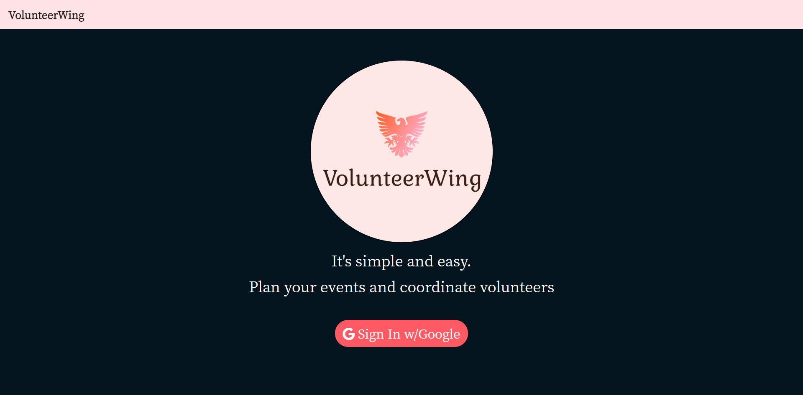

2. User Home Page
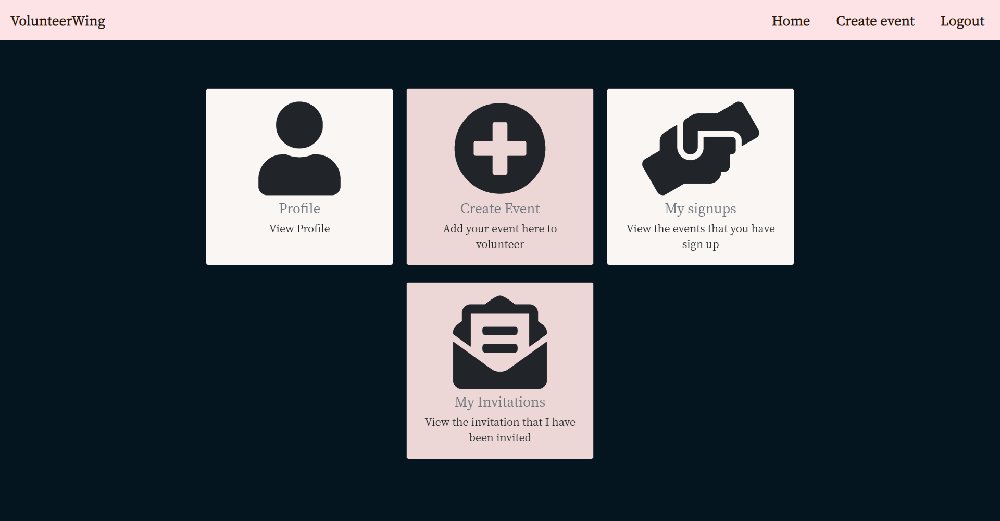

3. Admin Home Page
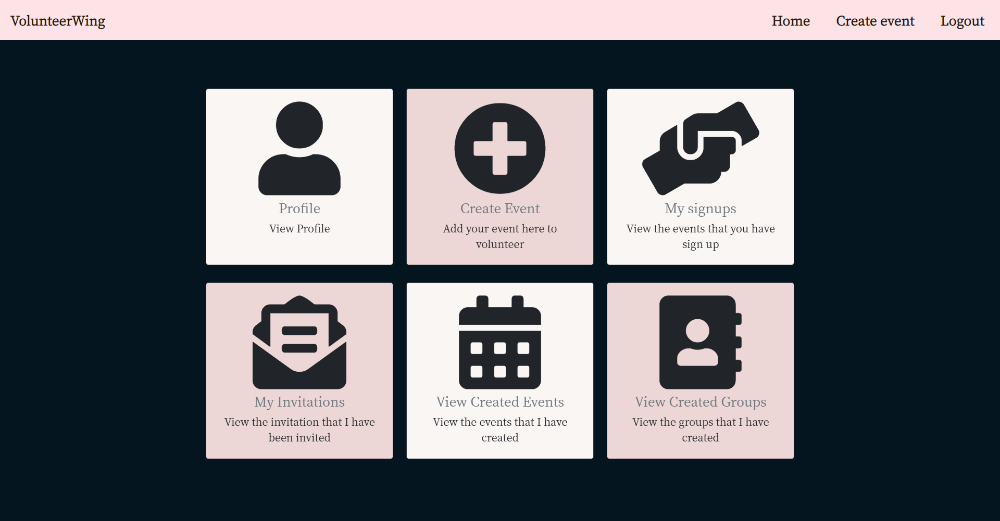

4. Profile Page
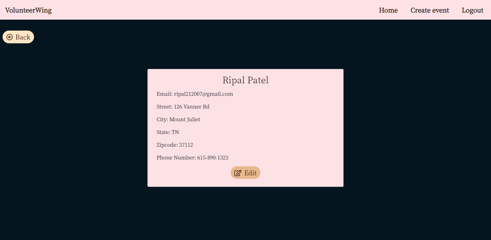

5. Create Event Page
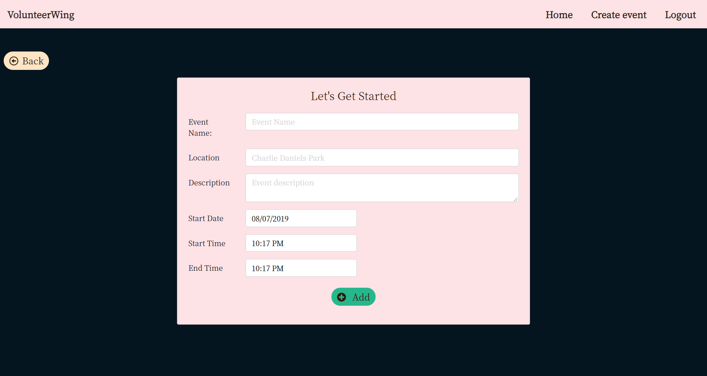

6. Add Tasks Page
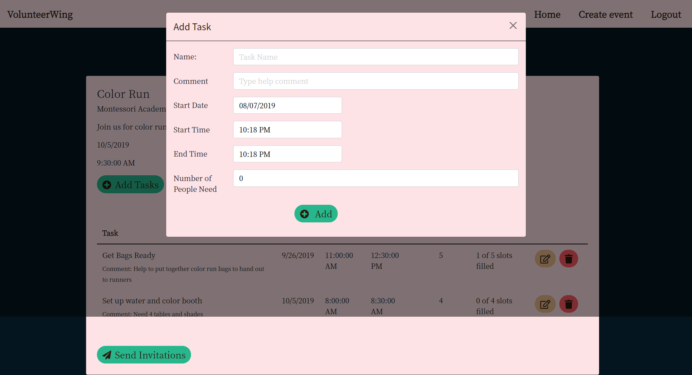

7. Send Invitation Page
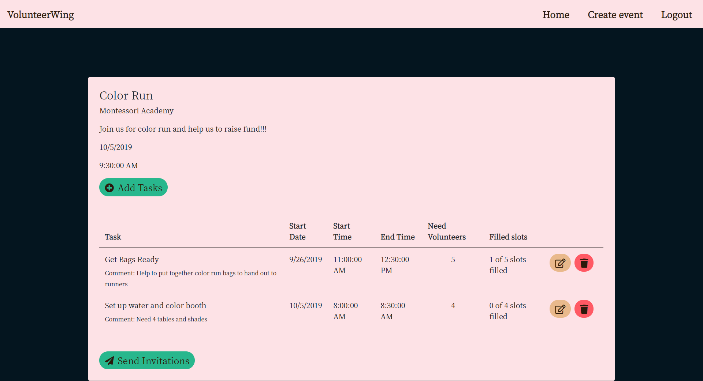

8. Invitation Modal
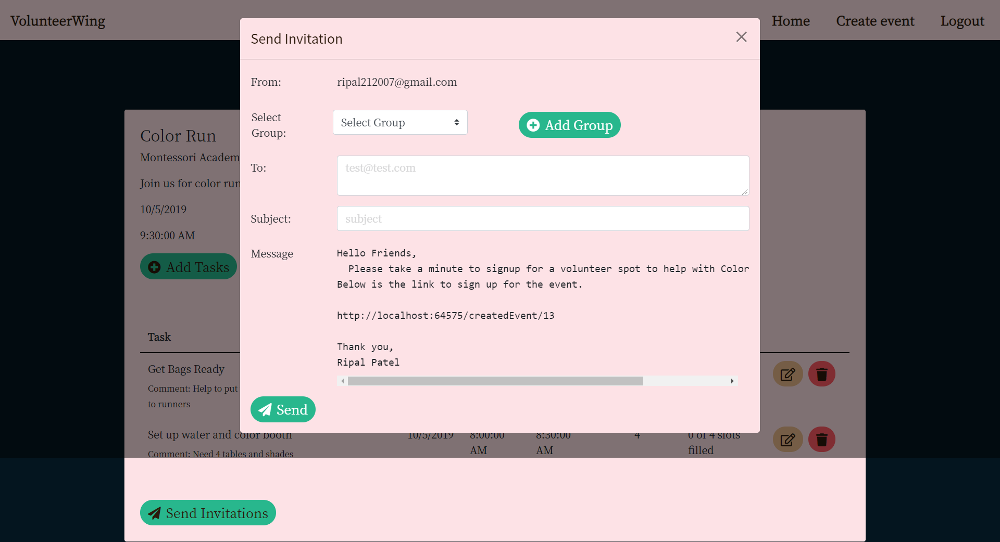

9. View Created Event Modal
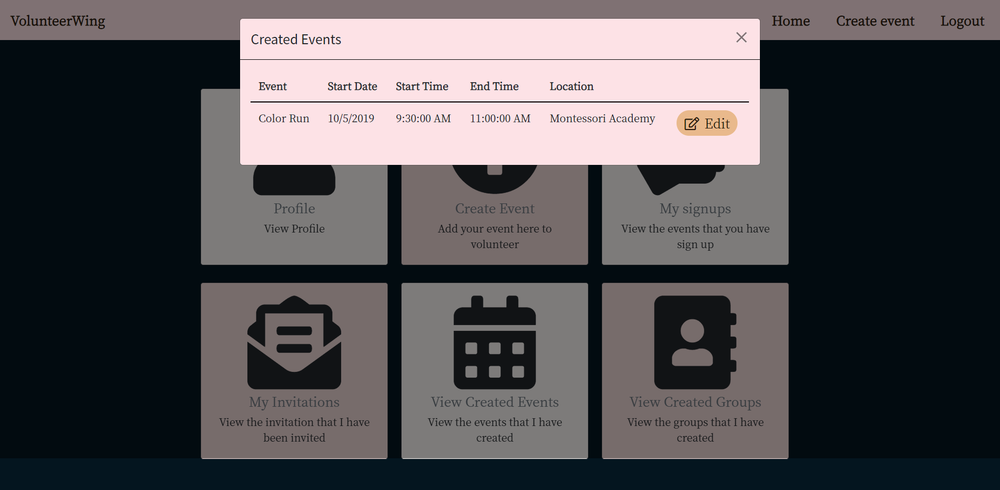

10. Sign up Page
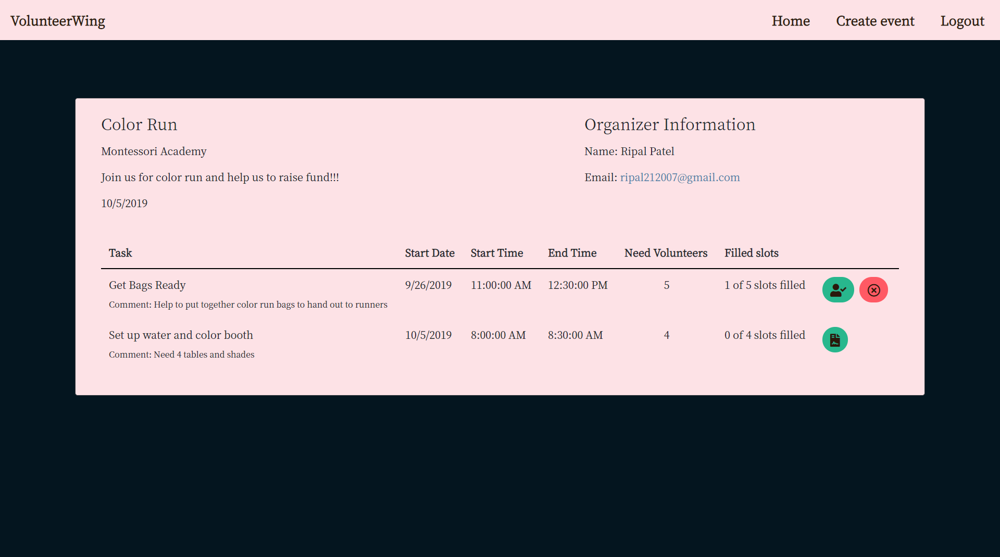

11. View Invitation Modal
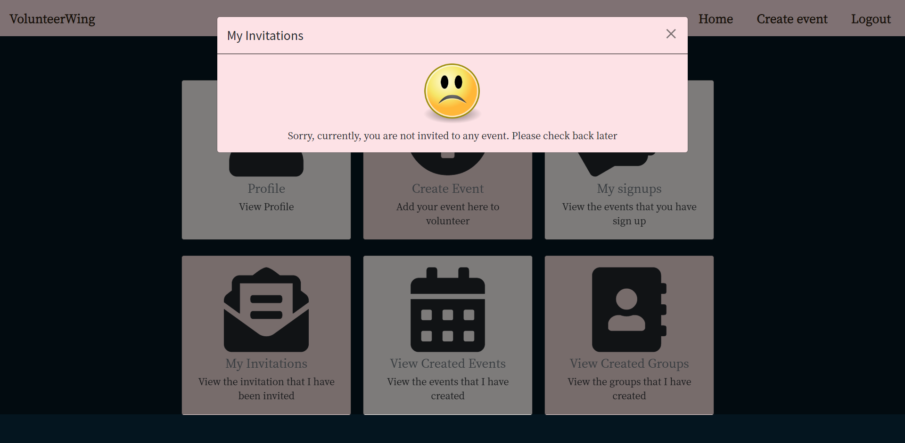

12. View Group Modal
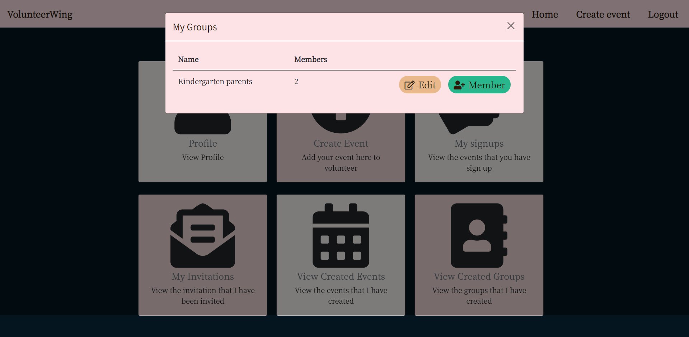

## How to Run this Project

1. Firebase Setup
    - Create a firebase project
    - Enable 'Google Authentication'
    - Create an constants.js file (an example file exists in the 'src' folder) -Copy firebase keys from firebase web app settings into constants.js

2. Serve up the app
    - Clone the repository to your local machine.
    - Browse to the repo directory in your terminal
    - In the ClientApp folder of the project, run `npm install` to install necessary dependencies
    - Run the project from Visual Studio

## Contributors:
[Ripal Patel](https://github.com/ripalpate/VolunteerWing)

Nathan Gonzalez (mentor)